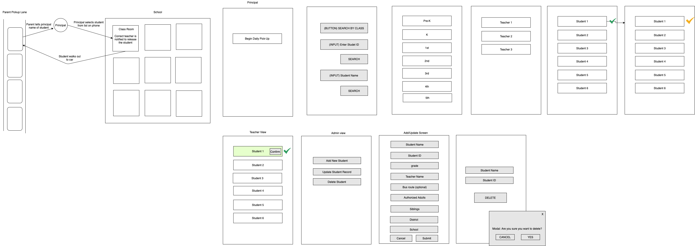
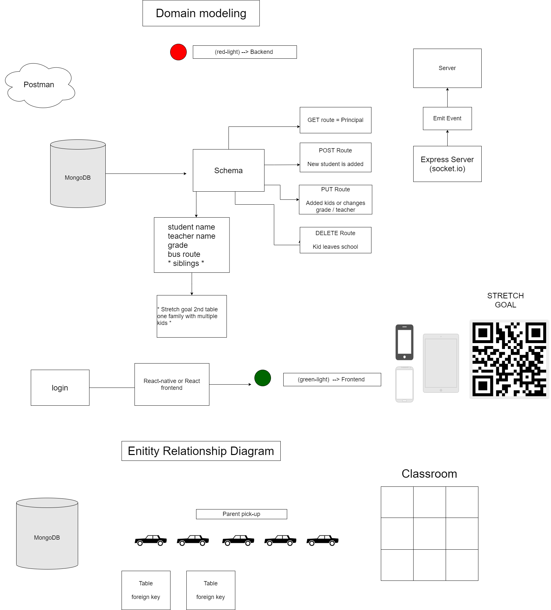

# Parent Pickup Coordinator

## Repo red-light
Dedicated to the backend

## Authors/Contributors 
Andre-Olivier Martin, Simon Panek, Stacy Burris, Tina Myers

### Description
Front end application that links to the red-light back end. The two combine to create an app that will help schools coordinate parent pick-up at the end of the school day, which is a much longer process in the time of Covid, while schools attempt to keep contact limited between children in different classes/pods. The app will provide a more organized, streamlined way of teachers being notified it’s time to send a child out when their ride arrives (whether that be a parent or a bus).

### Wireframes

### Domain Modeling/Entity relationship diagram

